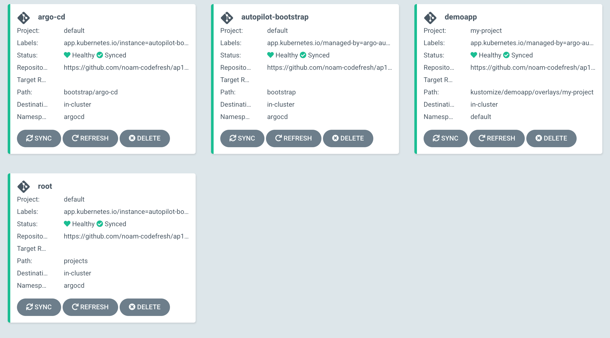
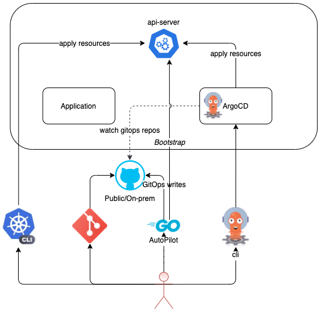

# Argo-CD Autopilot
[]( https://g.codefresh.io/public/accounts/codefresh-inc/pipelines/new/60881f8199c9564ef31aac61) [](https://codecov.io/gh/argoproj-labs/argocd-autopilot) [](https://argocd-autopilot.readthedocs.io/en/latest/?badge=latest)


## Introduction

The Argo-CD Autopilot is a tool which offers an opinionated way of installing Argo-CD and managing GitOps repositories.

It can:
- create a new gitops repository.
- bootstrap a new argo cd installation.
- install and manage argo-cd projects and application with ease.

## Installation
### Mac

```bash
# get the latest version or change to a specific version
VERSION=$(curl --silent "https://api.github.com/repos/argoproj-labs/argocd-autopilot/releases/latest" | grep '"tag_name"' | sed -E 's/.*"([^"]+)".*/\1/')

# download and extract the binary
curl -L --output - https://github.com/argoproj-labs/argocd-autopilot/releases/download/$VERSION/argocd-autopilot-darwin-amd64.gz | tar zx

# move the binary to your $PATH
mv ./argocd-autopilot-* /usr/local/bin/argocd-autopilot

# check the installation
argocd-autopilot version
```

### Linux
```bash
# get the latest version or change to a specific version
VERSION=$(curl --silent "https://api.github.com/repos/argoproj-labs/argocd-autopilot/releases/latest" | grep '"tag_name"' | sed -E 's/.*"([^"]+)".*/\1/')

# download and extract the binary
curl -L --output - https://github.com/argoproj-labs/argocd-autopilot/releases/download/$VERSION/argocd-autopilot-linux-amd64.gz | tar zx

# move the binary to your $PATH
mv ./argocd-autopilot-* /usr/local/bin/argocd-autopilot

# check the installation
argocd-autopilot version
```

## Getting Started
```
# Most of the commands need your git token, you can provide with --token to each command
# or export it beforehand:

    export GIT_TOKEN=<YOUR_TOKEN>

# 1. Create a new git repository

    argocd-autopilot repo create --owner <owner> --name <name>

# At this point you can specify the gitops repo in each command with --repo
# or you can export it as well:

    export GIT_REPO=<REPO_URL>

# 2. Run the bootstrap installation on your current kubernetes context.
# This will install argo-cd as well as the application-set controller.

    argocd-autopilot repo bootstrap

# 3. Create your first project

    argocd-autopilot project create my-project

# 4. Install your first application on your project

    argocd-autopilot app create demoapp --app github.com/argoproj-labs/argocd-autopilot/examples/demo-app/ -p my-project
```

Now, if you go to your Argo-CD UI, you should see something similar to this:



Head over to our [Getting Started](./docs/Getting-Started.md) guide for further details.

## How it works
The autopilot bootstrap command will deploy an Argo-CD manifest to a target k8s cluster, and will commit an Argo-CD Application manifest under a specific directory in your GitOps repository. This Application will manage the Argo-CD installation itself - so after running this command, you will have an Argo-CD deployment that manages itself through GitOps.

From that point on, the use can create Projects and Applications that belong to them. Autopilot will commit the required manifests to the repository. Once committed, Argo-CD will do its magic and apply the Applications to the cluster.

An application can be added to a project from a public git repo + path, or from a directory in the local filesystem.

## Architecture


Autopilot communicates with the cluster directly **only** during the bootstrap phase, when it deploys Argo-CD. After that, most commands will only require access to the GitOps repository. When adding a Project or Application to a remote k8s cluster, autopilot will require access to the Argo-CD server.

You can read more about it in the [official proposal doc](https://docs.google.com/document/d/1gxKxaMQzH9nNDWW9mZV5_cS7EO4S-pm1s_u5aMK-PZQ/edit?usp=sharing).

## Features
* Opinionated way to build a multi-project multi-application system, using GitOps principles.
* Create a new GitOps repository, or use an existing one.
* Supports creating the entire directory structure under any path the user requires.
* When adding applications from a public repo, allow committing as either a kustomization that references the public repo, or as a "flat" manifest file containing all the required resources.
* Use a different cluster from the one Argo-CD is running on, as a default cluster for a Project, or a target cluster for a specific Application.

## Development Status
Argo-CD autopilot is currently under active development. Some of the basic commands are not yet implemented, but we hope to complete most of them in the coming weeks.
