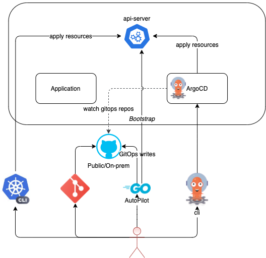

New users to GitOps and Argo CD are not often sure how they should structure their repos, add applications, promote apps across environments, and manage the Argo CD installation itself using GitOps.

Argo CD Autopilot saves operators time by:

- Installing and managing the Argo CD application using GitOps.
- Providing a clear structure for how applications are to be added and updated, all from git.
- Creating a simple pattern for making updates to applications and promoting those changes across environments.
- Enabling better disaster recovery by being able to bootstrap new clusters with all the applications previously installed.
- Handling secrets for Argo CD to prevent them from spilling into plaintext git. (Soon to come)

The Argo-CD Autopilot is a tool which offers an opinionated way of installing Argo-CD and managing GitOps repositories.

## How it Works
The autopilot bootstrap command will deploy an Argo CD manifest to a target K8s cluster and will commit an Argo CD Application manifest under a specific directory in your GitOps repository. This Application will manage the Argo CD installation itself - so after running this command, you will have an Argo CD deployment that manages itself through GitOps.

From that point on, the user can create Projects and Applications that belong to them. Autopilot will commit the required manifests to the repository. Once committed, Argo CD will do its magic and apply the Applications to the cluster.

An application can be added to a project from a public Git repo + path or a directory in the local filesystem.

## Architecture

Autopilot communicates with the cluster directly **only** during the bootstrap phase, when it deploys Argo CD. After that, most commands will only require access to the GitOps repository. When adding a project or application to a remote K8s cluster, the autopilot will require access to the Argo CD server.

## Features
* Opinionated way to build a multi-project multi-application system, using GitOps principles
* Create a new GitOps repository, or use an existing one
* Supports creating the entire directory structure under any path the user requires
* When adding applications from a public repo, allow committing as a Kustomization file that references the public repo, or a "flat" manifest file containing all the required resources
* Use a different cluster from the one Argo CD is running on, as a default cluster for a project, or a target cluster for a specific application

## Development Status
Argo CD autopilot is currently under active development. Some of the basic commands are not yet implemented, but we hope to complete them in the coming weeks.
